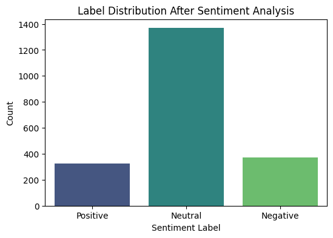
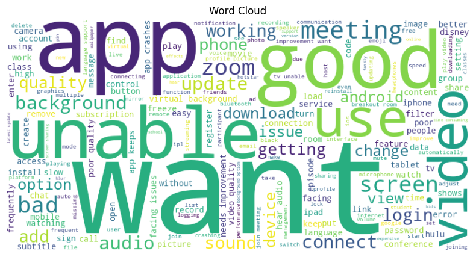
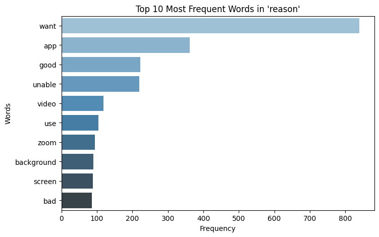
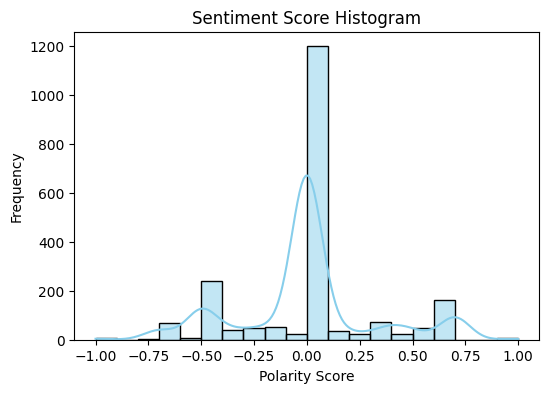
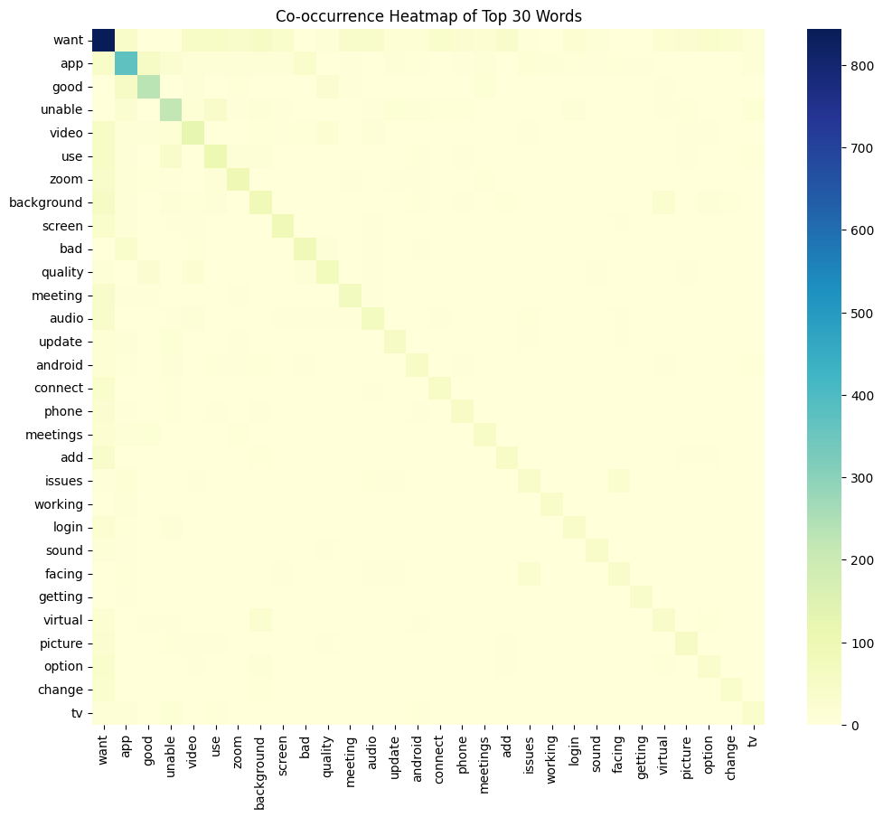
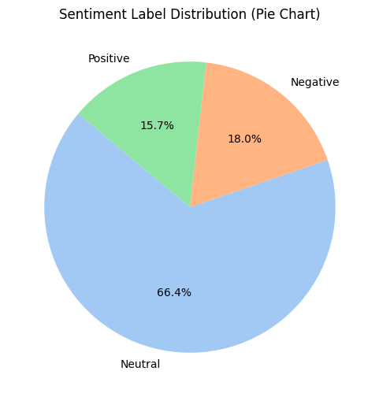

# Sentiment Analysis and Visualization on Feedback Data

## Project Overview

This project performs sentiment analysis on feedback data stored in an Excel file (`train.xlsx`). The feedback text is processed to determine the sentiment (Positive, Negative, Neutral) using the TextBlob library. Various visualizations are generated to analyze and understand the sentiment distribution and key features in the feedback.

The notebook covers the following tasks:
1. Loading the data and performing sentiment analysis.
2. Creating visualizations including:
   - Sentiment label distribution
   - Word cloud of all feedback
   - Top frequent words after stopword removal
   - Sentiment score histogram
   - Co-occurrence heatmap of top words
   - Pie chart for sentiment label distribution

## Libraries Used

- `pandas`: Data manipulation and analysis.
- `matplotlib`: Plotting library.
- `seaborn`: Statistical data visualization.
- `wordcloud`: Generate word clouds from text data.
- `textblob`: Sentiment analysis library.
- `scikit-learn`: Feature extraction using CountVectorizer.
- `openpyxl`: Read and write Excel files.

## Steps to Run the Project

1. **Install Required Libraries**: 
   First, ensure you have all necessary libraries by using the `requirements.txt` file. To install the required libraries, run:

   ```bash
   pip install -r requirements.txt
## Sample Output

The visualizations produced by the notebook include:

1. **Label Distribution After Sentiment Analysis**:
   

2. **Word Cloud of All Feedback**:
   

3. **Top 10 Most Frequent Words in 'reason'**:
   

4. **Sentiment Score Histogram**:
   

5. **Co-occurrence Heatmap of Top 30 Words**:
   

6. **Sentiment Label Distribution (Pie Chart)**:
   

